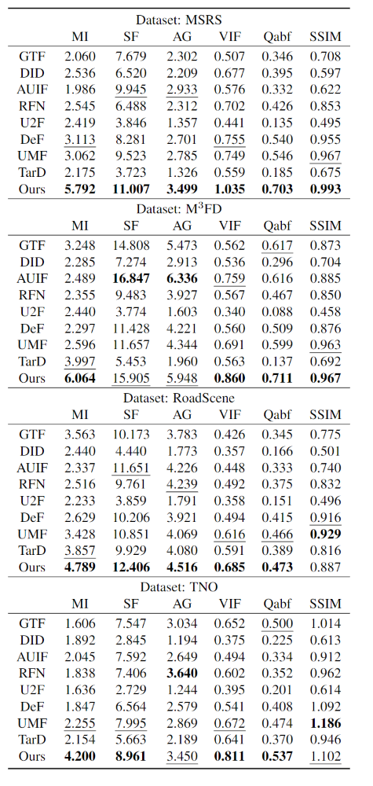

### SSPFusion

#### Code

Codes will be released after the paper is accepted for publication.

#### Comparison Examples

Qualitative comparison of our SSPFusion and eight state-of-the-art methods on the MSRS, M3FD, RoadScene and TNO, respectively.

Quantitative comparison of our SSPFusion and eight state-of-the-art methods on the MSRS, M3FD, RoadScene and TNO, respectively.

